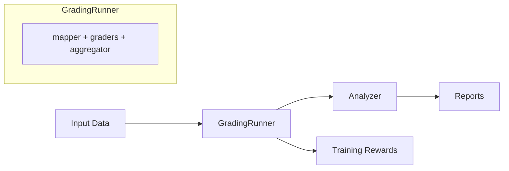

# :rocket: Core Concepts

Understanding RM-Gallery's **core concepts** will help you effectively evaluate AI models and extend the system for your specific needs. This guide walks you through the fundamental components and how they work together.

Whether you're new to RM-Gallery or looking to build custom evaluation workflows, this guide covers everything you need to know about integrating RM-Gallery with your systems and extending it with custom components.

## :card_file_box: Framework Overview

RM-Gallery provides a **modular architecture** for AI model evaluation with a centralized [GradingRunner](../../rm_gallery/core/runner/grading_runner.py) that orchestrates the evaluation process. You'll use this when you need to:

- Evaluate multiple aspects of AI-generated content
- Combine different evaluation criteria into unified scores
- Generate training rewards for reinforcement learning
- Analyze model performance across various dimensions

The framework supports two primary usage modes depending on your needs:



Here's how data flows through the system:

1. **Input Data**: You provide the data samples to be evaluated
2. **GradingRunner**: The core engine that processes your data through three internal modules:
   - **Mapper**: Transforms your data fields to match grader parameter names
   - **Graders**: Execute evaluations on the transformed data
   - **Aggregator**: Combines results from multiple graders into unified scores
3. **Output**: Depending on your use case, the results can either:
   - Flow to an **Analyzer** to generate detailed **Reports** for comprehensive evaluation
   - Be used directly as **Training Rewards** for model training purposes

Let's walk through a simple example to illustrate how this works in practice:

```python
from rm_gallery.core.runner.grading_runner import GradingRunner
from rm_gallery.core.graders.common.helpfulness import HelpfulnessGrader
from rm_gallery.core.graders.common.relevance import RelevanceGrader

# Prepare your data in whatever format works for you
data = [
    {
        "query": "What is the capital of France?",
        "response": "Paris",
        "reference_answer": "Paris"
    }
]

# Configure graders with mappers to connect your data fields
graders = {
    "helpfulness": {
        "grader": HelpfulnessGrader(),
        "mapper": {"question": "query", "answer": "response"}
    },
    "relevance": {
        "grader": RelevanceGrader(),
        "mapper": {"q": "query", "a": "response", "ref": "reference_answer"}
    }
}

# Run evaluation
runner = GradingRunner(graders)
results = await runner.arun(data)

# Results contain scores from all graders that you can use for analysis or training
```

## :hammer: Core Components

Now that we've seen the big picture, let's dive deeper into each component of the RM-Gallery framework.

### :inbox_tray: Input Data

From a framework user's perspective, **input data** is typically a list of dictionaries where each dictionary represents a sample to be evaluated.

The beauty of RM-Gallery is that your data can be in any format that suits your use case:

```python
data = [
    {
        "query": "What is the capital of France?",
        "response": "Paris",
        "reference": "Paris"
    },
    {
        "query": "What is 2+2?",
        "response": "5",
        "reference": "4"
    }
]
```

The GradingRunner's **mapper** functionality allows you to transform your data fields to match the parameter names expected by your chosen graders, so you don't need to restructure your data to fit the framework's expectations.

### :rocket: GradingRunner

[GradingRunner](../../rm_gallery/core/runner/grading_runner.py) is the central execution engine of RM-Gallery. As a framework user, you'll configure and use **GradingRunner** to orchestrate your entire evaluation workflow. It manages **graders**, **data mapping**, and **result aggregation** internally.

#### Configuration

To use **GradingRunner**, you'll create a dictionary of grader configurations where keys are grader names and values are either **GraderConfig** instances, **BaseGrader** instances, tuples of (**BaseGrader**, mapper) or dictionaries with grader and mapper keys:

```python
grader_configs = {
    "helpfulness": HelpfulnessGrader(),
    "relevance": {
        "grader": RelevanceGrader(),
        "mapper": {"q": "query", "a": "response"}
    },
    "accuracy": {
        "grader": AccuracyGrader(),
        "mapper": {"question": "query", "answer": "response", "reference": "reference"}
    }
}

runner = GradingRunner(
    grader_configs=grader_configs,
    max_concurrency=10,
    aggregators=[WeightedSumAggregator(weights={"helpfulness": 0.5, "relevance": 0.3, "accuracy": 0.2})]
)
```

#### GradingRunner Internal Components

The **GradingRunner** achieves its comprehensive evaluation capabilities through three core sub-modules working in sequence:

##### Mapper

The **Mapper** module transforms your input data to match the parameter names expected by your graders. Since your input data may not have the exact field names that your graders expect, mappers provide a way to map between your data structure and the grader's expected inputs.

Types of mappers:
- **Dictionary mappers**: Simple key-value mappings (e.g., `{"question": "query", "answer": "response"}`)
- **Callable mappers**: Custom functions that transform data in more complex ways

Each grader can have its own mapper, allowing you to handle different data transformations for different evaluation criteria.

##### Graders

**Graders** are the core evaluation components that assess your model's outputs. The **GradingRunner** manages the execution of these graders on the mapped data.

###### BaseGrader
[BaseGrader](../../rm_gallery/core/graders/base_grader.py) is the abstract base class that defines the interface for all graders. While you won't instantiate this directly, understanding its interface helps when working with any grader.

Key concepts:
- **GraderMode**: Graders operate in either POINTWISE (evaluating individual samples) or LISTWISE (ranking multiple samples) mode
- **Asynchronous Evaluation**: All graders implement an `aevaluate` method for async evaluation
- **Standardized Results**: Graders return consistent result objects (**GraderScore**, **GraderRank**, or **GraderError**)

###### FunctionGrader
[FunctionGrader](../../rm_gallery/core/graders/function_grader.py) performs evaluations using predefined functions or rules. These are ideal when you have deterministic criteria for evaluation.

Use cases:
- String matching
- Format validation
- Mathematical computations
- Rule-based assessments

###### LLMGrader
[LLMGrader](../../rm_gallery/core/graders/llm_grader.py) uses large language models to perform sophisticated evaluations. These graders construct prompts with customizable templates and rubrics, send them to an LLM, and parse structured responses.

Use cases:
- Assessing response quality
- Evaluating helpfulness or relevance
- Complex reasoning tasks
- Subjective assessments

###### Pre-built Graders

RM-Gallery includes many domain-specific graders organized in submodules:

- **common/**: General-purpose graders (helpfulness, hallucination, harmfulness, compliance)
- **agent/**: Agent capability evaluation (planning, tool usage, memory, etc.)
- **code/**: Code-related evaluation (execution correctness, style, patch similarity)
- **format/**: Format compliance checking (JSON validation, structure verification)
- **multimodal/**: Multimodal content evaluation (image-text alignment, visual helpfulness)

##### Aggregators

After running multiple graders, you might want to combine their results into a single score. **Aggregators** are components that take multiple grader results and combine them into a unified result.

[BaseAggregator](../../rm_gallery/core/runner/aggregator/base_aggregator.py) defines the interface for all aggregators. RM-Gallery provides several built-in aggregators, such as:

- **WeightedSumAggregator**: Combines results using weighted averages
- **MaxAggregator**: Takes the maximum score among all graders
- **MinAggregator**: Takes the minimum score among all graders

You configure aggregators when setting up your **GradingRunner**, and they automatically process the results from multiple graders.

### :mag: Analyzers

**Analyzer** is an optional component in RM-Gallery. After running evaluations with the **GradingRunner**, you can use analyzers to process the results and gain deeper insights. For training scenarios, you can skip this step and directly use the **GradingRunner's** output.

[BaseAnalyzer](../../rm_gallery/core/analyzer/base_analyzer.py) defines the interface for all analyzers. As a user, you can apply analyzers to your evaluation results to gain insights.

Types of analyzers:
- **Statistical Analyzers**: Compute statistics on evaluation results (e.g., DistributionAnalyzer)
- **Validation Analyzers**: Compare evaluation results with reference labels (e.g., AccuracyAnalyzer, F1ScoreAnalyzer)

## Extension Capabilities

RM-Gallery is designed to be extensible, allowing you to customize and enhance its capabilities to meet your specific needs. The framework provides several extension points that enable you to add new functionality or modify existing behavior.

### Core Extension Points

1. **Custom Graders**: Inherit from **BaseGrader** to create domain-specific evaluation logic
2. **Custom Analyzers**: Extend **BaseAnalyzer** to implement specialized result analysis
3. **Custom Aggregators**: Implement **BaseAggregator** to create new ways of combining grader results

### Supporting Components Extensions

In addition to the core components, RM-Gallery provides several supporting components that can be extended to enhance the framework's capabilities:

#### Models

When using **LLMGraders**, you'll need to specify which language models to use for evaluation. RM-Gallery provides wrappers for popular model providers. These are auxiliary components that support the **LLMGrader** functionality:

- [BaseChatModel](../../rm_gallery/core/models/base_chat_model.py): Abstract base class for all chat models
- [OpenAIChatModel](../../rm_gallery/core/models/openai_chat_model.py): Interface for OpenAI models
- [DashScopeChatModel](../../rm_gallery/core/models/dashscope_chat_model.py): Interface for Alibaba DashScope models
- [QwenVLModel](../../rm_gallery/core/models/qwen_vl_model.py): Interface for Qwen vision-language models

You can implement **BaseChatModel** to support additional LLM providers or create custom model interfaces.

#### Prompt Templates

[PromptTemplate](../../rm_gallery/core/models/schema/prompt_template.py) provides a structured way to define and manage prompts for LLM-based evaluations. It supports multi-language templates and dynamic variable substitution.

#### Rubrics

A **rubric** is a set of criteria or guidelines used by an **LLMGrader** to perform evaluations. Rubrics help ensure consistent and objective evaluations by clearly defining what constitutes a good or poor response for a given task.

Learn more about [AutoRubric generation](../../building_graders/generate_graders_from_data.md) to automatically create rubrics from your data.

#### Grader Generators

The [generator](../../rm_gallery/core/generator/) module provides tools to automatically create graders from data. This is particularly useful when you have annotated datasets and want to bootstrap evaluation criteria.

The generator module includes:

- **BaseGraderGenerator**: The base class for all grader generators
- **LLMGraderGenerator**: Generates LLM-based graders by using language models to create rubrics from data

These generators can significantly reduce the effort required to create domain-specific graders by learning from examples.

See our guide on [generating graders from data](../../building_graders/generate_graders_from_data.md) for practical examples.